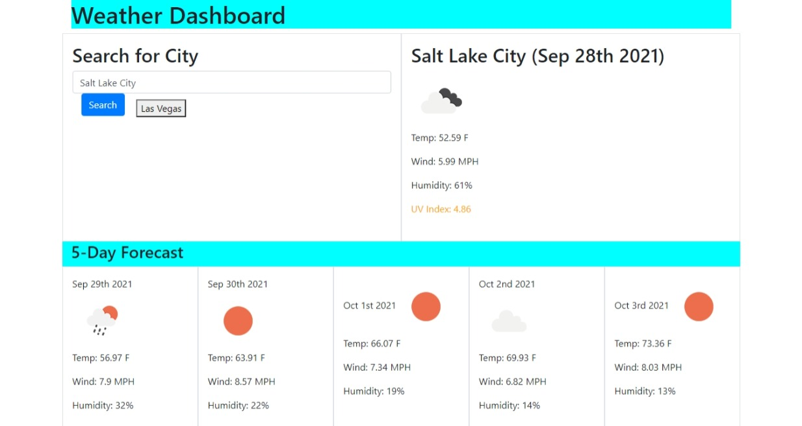

# weather-dashboard
This program displays the weather conditions for the current day as well as for the next five days of a given U.S. city. The user types in the name of the city in the search bar and the current weather will be displayed directly to the right of that panel. Below, the forecast for the next five days of that city will be displayed consecutively in a row. Information is called and received from the OpenWeather API.

Here is link: https://donk1557.github.io/weather-dashboard/

Image of site:  

## weather info
The user is shown the date, an icon for the kind of weather it will be/is, the temperature (in Fahrenheit), wind speed (in miles per hour), and the humidity in that order. The current weather panel also has additional information for the UV index and the text for the UV index is color-coded based on a severity scale (green = low; orange = moderate; red = high).

## search engine
User inputs city name and clicks the search button. Previous results are listed under the search bar and can be clicked to display results for the that city.